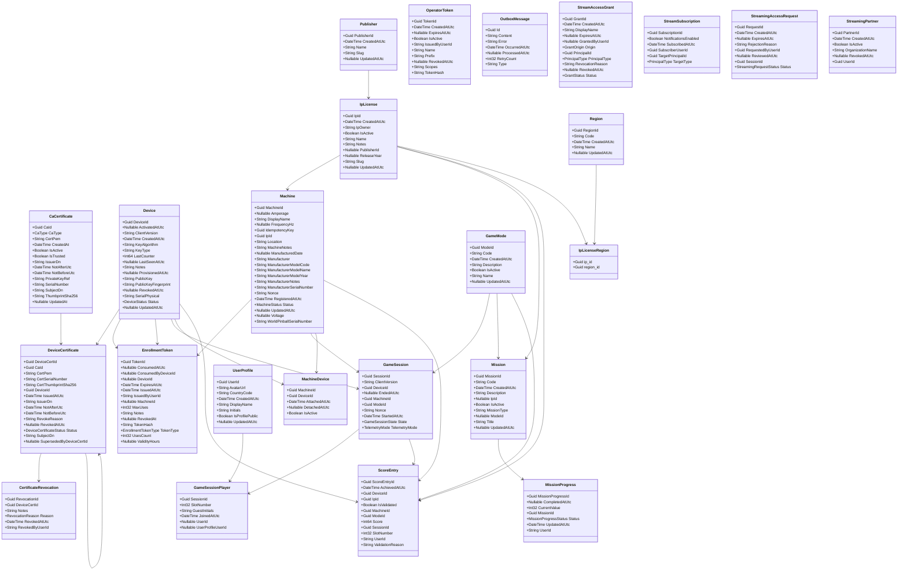

# Diagramme de Classes du Domaine (WorldPinball)

```mermaid
classDiagram
  class CaCertificate {
    +Guid CaId
    +CaType CaType
    +String CertPem
    +DateTime CreatedAt
    +Boolean IsActive
    +Boolean IsTrusted
    +String IssuerDn
    +DateTime NotAfterUtc
    +DateTime NotBeforeUtc
    +String PrivateKeyRef
    +String SerialNumber
    +String SubjectDn
    +String ThumbprintSha256
    +Nullable UpdatedAt
  }
  class CertificateRevocation {
    +Guid RevocationId
    +Guid DeviceCertId
    +String Notes
    +RevocationReason Reason
    +DateTime RevokedAtUtc
    +String RevokedByUserId
  }
  DeviceCertificate --> CertificateRevocation
  class Device {
    +Guid DeviceId
    +Nullable ActivatedAtUtc
    +String ClientVersion
    +DateTime CreatedAtUtc
    +String KeyAlgorithm
    +String KeyType
    +Int64 LastCounter
    +Nullable LastSeenAtUtc
    +String Notes
    +Nullable ProvisionedAtUtc
    +String PublicKey
    +String PublicKeyFingerprint
    +Nullable RevokedAtUtc
    +String SerialPhysical
    +DeviceStatus Status
    +Nullable UpdatedAtUtc
  }
  class DeviceCertificate {
    +Guid DeviceCertId
    +Guid CaId
    +String CertPem
    +String CertSerialNumber
    +String CertThumbprintSha256
    +Guid DeviceId
    +DateTime IssuedAtUtc
    +String IssuerDn
    +DateTime NotAfterUtc
    +DateTime NotBeforeUtc
    +String RevokeReason
    +Nullable RevokedAtUtc
    +DeviceCertificateStatus Status
    +String SubjectDn
    +Nullable SupersededByDeviceCertId
  }
  CaCertificate --> DeviceCertificate
  Device --> DeviceCertificate
  DeviceCertificate --> DeviceCertificate
  class EnrollmentToken {
    +Guid TokenId
    +Nullable ConsumedAtUtc
    +Nullable ConsumedByDeviceId
    +Nullable DeviceId
    +DateTime ExpiresAtUtc
    +DateTime IssuedAtUtc
    +String IssuedByUserId
    +Nullable MachineId
    +Int32 MaxUses
    +String Notes
    +Nullable RevokedAt
    +String TokenHash
    +EnrollmentTokenType TokenType
    +Int32 UsesCount
    +Nullable ValidityHours
  }
  Device --> EnrollmentToken
  Device --> EnrollmentToken
  Machine --> EnrollmentToken
  class GameMode {
    +Guid ModeId
    +String Code
    +DateTime CreatedAtUtc
    +String Description
    +Boolean IsActive
    +String Name
    +Nullable UpdatedAtUtc
  }
  class GameSession {
    +Guid SessionId
    +String ClientVersion
    +Guid DeviceId
    +Nullable EndedAtUtc
    +Guid MachineId
    +Guid ModeId
    +String Nonce
    +DateTime StartedAtUtc
    +GameSessionState State
    +TelemetryMode TelemetryMode
  }
  Device --> GameSession
  Machine --> GameSession
  GameMode --> GameSession
  class GameSessionPlayer {
    +Guid SessionId
    +Int32 SlotNumber
    +String GuestInitials
    +DateTime JoinedAtUtc
    +Nullable UserId
    +Nullable UserProfileUserId
  }
  GameSession --> GameSessionPlayer
  UserProfile --> GameSessionPlayer
  class IpLicense {
    +Guid IpId
    +DateTime CreatedAtUtc
    +String IpOwner
    +Boolean IsActive
    +String Name
    +String Notes
    +Nullable PublisherId
    +Nullable ReleaseYear
    +String Slug
    +Nullable UpdatedAtUtc
  }
  Publisher --> IpLicense
  class Machine {
    +Guid MachineId
    +Nullable Amperage
    +String DisplayName
    +Nullable FrequencyHz
    +Guid IdempotencyKey
    +Guid IpId
    +String Location
    +String MachineNotes
    +Nullable ManufacturedDate
    +String Manufacturer
    +String ManufacturerModelCode
    +String ManufacturerModelName
    +String ManufacturerModelYear
    +String ManufacturerNotes
    +String ManufacturerSerialNumber
    +String Nonce
    +DateTime RegisteredAtUtc
    +MachineStatus Status
    +Nullable UpdatedAtUtc
    +Nullable Voltage
    +String WorldPinballSerialNumber
  }
  IpLicense --> Machine
  class MachineDevice {
    +Guid MachineId
    +Guid DeviceId
    +DateTime AttachedAtUtc
    +Nullable DetachedAtUtc
    +Boolean IsActive
  }
  Device --> MachineDevice
  Machine --> MachineDevice
  class Mission {
    +Guid MissionId
    +String Code
    +DateTime CreatedAtUtc
    +String Description
    +Nullable IpId
    +Boolean IsActive
    +String MissionType
    +Nullable ModeId
    +String Title
    +Nullable UpdatedAtUtc
  }
  IpLicense --> Mission
  GameMode --> Mission
  class MissionProgress {
    +Guid MissionProgressId
    +Nullable CompletedAtUtc
    +Int32 CurrentValue
    +Guid MissionId
    +MissionProgressStatus Status
    +DateTime UpdatedAtUtc
    +String UserId
  }
  Mission --> MissionProgress
  class OperatorToken {
    +Guid TokenId
    +DateTime CreatedAtUtc
    +Nullable ExpiresAtUtc
    +Boolean IsActive
    +String IssuedByUserId
    +String Name
    +String Prefix
    +Nullable RevokedAtUtc
    +String Scopes
    +String TokenHash
  }
  class OutboxMessage {
    +Guid Id
    +String Content
    +String Error
    +DateTime OccurredAtUtc
    +Nullable ProcessedAtUtc
    +Int32 RetryCount
    +String Type
  }
  class Publisher {
    +Guid PublisherId
    +DateTime CreatedAtUtc
    +String Name
    +String Slug
    +Nullable UpdatedAtUtc
  }
  class Region {
    +Guid RegionId
    +String Code
    +DateTime CreatedAtUtc
    +String Name
    +Nullable UpdatedAtUtc
  }
  class ScoreEntry {
    +Guid ScoreEntryId
    +DateTime AchievedAtUtc
    +Guid DeviceId
    +Guid IpId
    +Boolean IsValidated
    +Guid MachineId
    +Guid ModeId
    +Int64 Score
    +Guid SessionId
    +Int32 SlotNumber
    +String UserId
    +String ValidationReason
  }
  Device --> ScoreEntry
  IpLicense --> ScoreEntry
  Machine --> ScoreEntry
  GameMode --> ScoreEntry
  GameSession --> ScoreEntry
  class StreamAccessGrant {
    +Guid GrantId
    +DateTime CreatedAtUtc
    +String DisplayName
    +Nullable ExpiresAtUtc
    +Nullable GrantedByUserId
    +GrantOrigin Origin
    +Guid PrincipalId
    +PrincipalType PrincipalType
    +String RevocationReason
    +Nullable RevokedAtUtc
    +GrantStatus Status
  }
  class StreamSubscription {
    +Guid SubscriptionId
    +Boolean NotificationsEnabled
    +DateTime SubscribedAtUtc
    +Guid SubscriberUserId
    +Guid TargetPrincipalId
    +PrincipalType TargetType
  }
  class StreamingAccessRequest {
    +Guid RequestId
    +DateTime CreatedAtUtc
    +Nullable ExpiresAtUtc
    +String RejectionReason
    +Guid RequestedByUserId
    +Nullable ReviewedAtUtc
    +Guid SessionId
    +StreamingRequestStatus Status
  }
  class StreamingPartner {
    +Guid PartnerId
    +DateTime CreatedAtUtc
    +Boolean IsActive
    +String OrganizationName
    +Nullable RevokedAtUtc
    +Guid UserId
  }
  class UserProfile {
    +Guid UserId
    +String AvatarUrl
    +String CountryCode
    +DateTime CreatedAtUtc
    +String DisplayName
    +String Initials
    +Boolean IsProfilePublic
    +Nullable UpdatedAtUtc
  }
  class IpLicenseRegion {
    +Guid ip_id
    +Guid region_id
  }
  IpLicense --> IpLicenseRegion
  Region --> IpLicenseRegion
```
